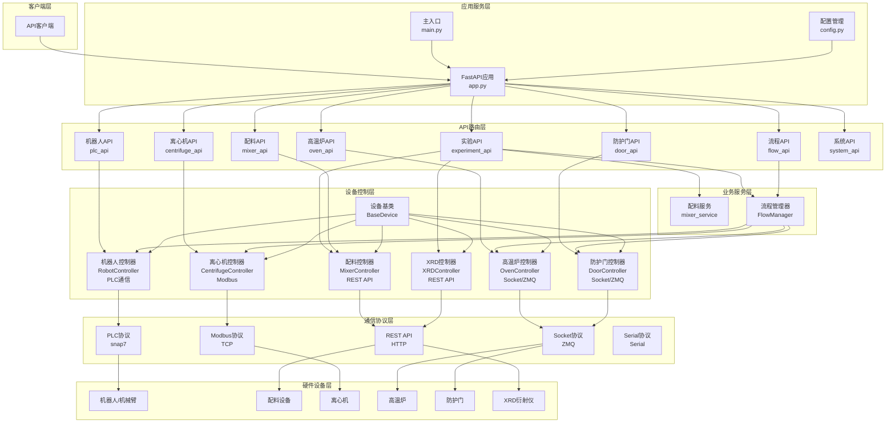
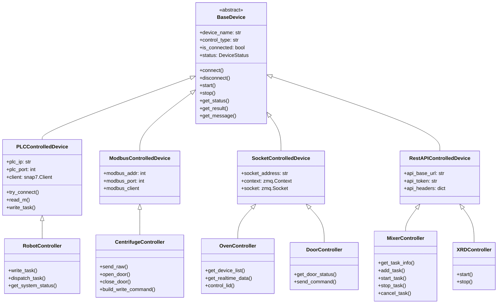
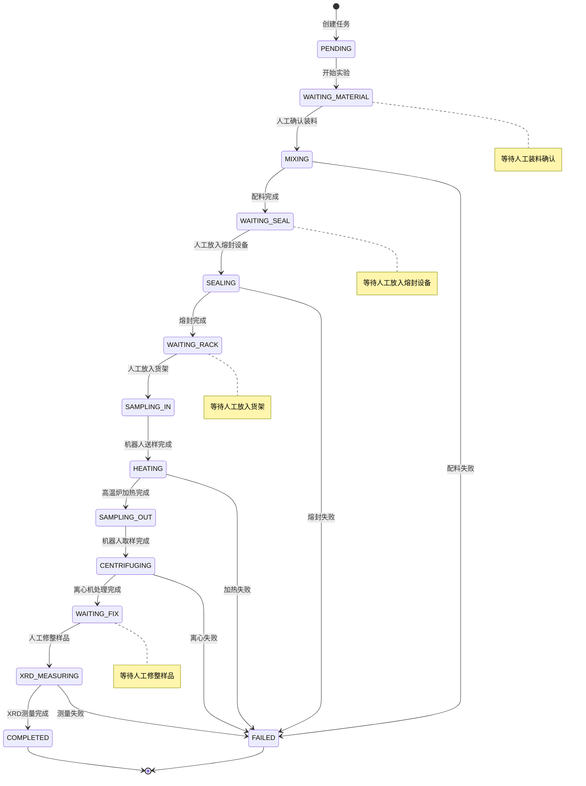
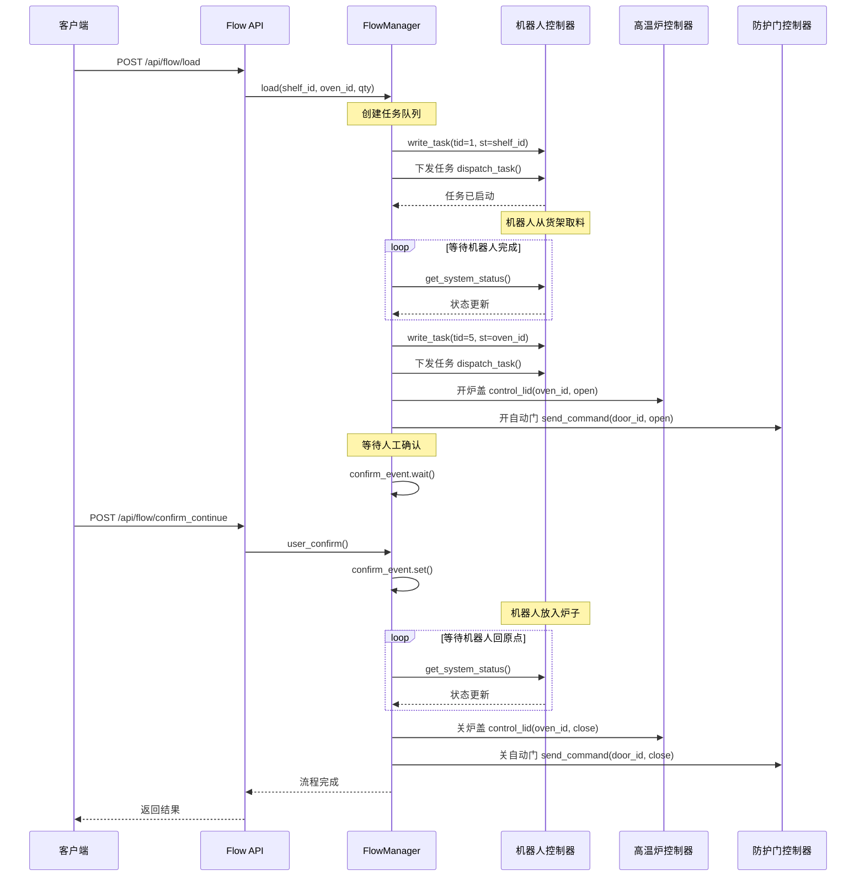
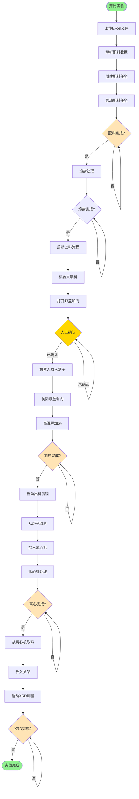
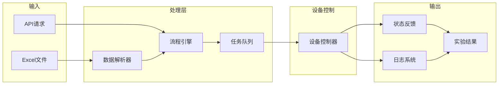
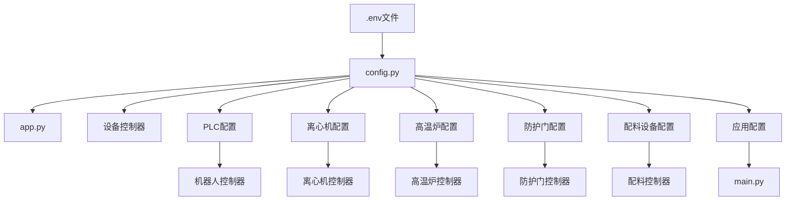
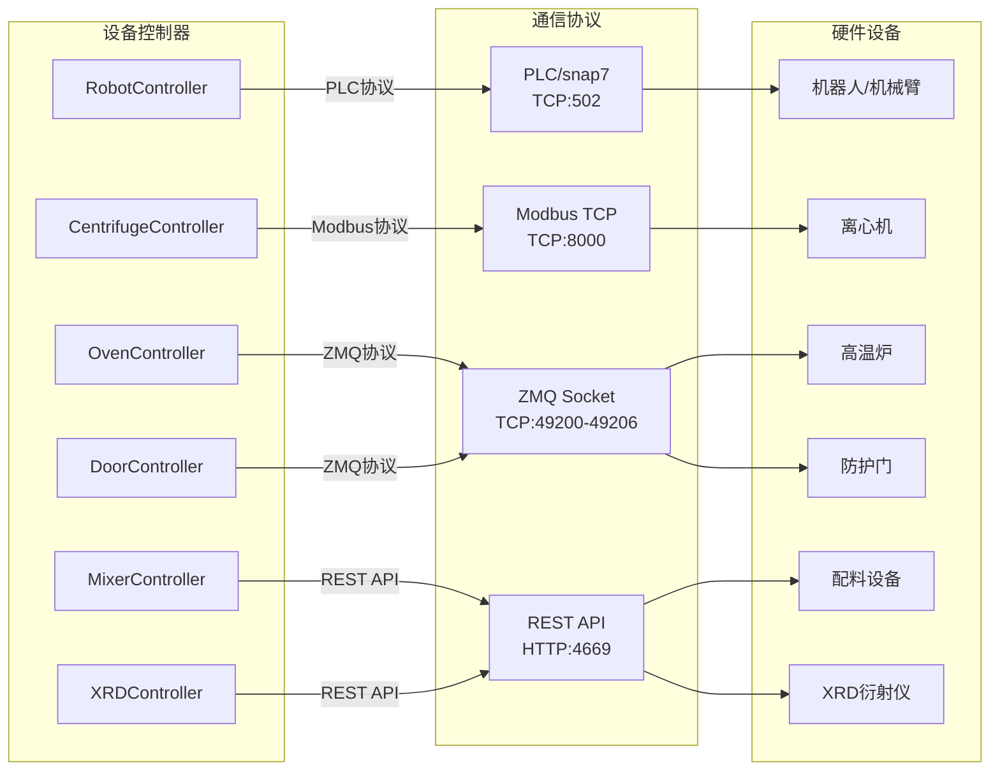

# 系统架构流程图

## 1. 整体系统架构

## 2. 设备控制类继承关系

## 3. 实验流程状态机

## 4. 上料流程（Load Flow）

## 5. 出料流程（Unload Flow）

```mermaid
sequenceDiagram
    participant Client as 客户端
    participant API as Flow API
    participant FM as FlowManager
    participant Robot as 机器人控制器
    participant Oven as 高温炉控制器
    participant Door as 防护门控制器
    participant Cent as 离心机控制器
    
    Client->>API: POST /api/flow/unload
    API->>FM: unload(oven_id, slot_id, shelf_id)
    
    Note over FM: 创建任务队列
    
    rect rgb(71, 43, 43)
        Note over FM,Robot: 步骤1: 炉子取
        FM->>Oven: 开炉盖 control_lid(oven_id, open)
        FM->>Door: 开自动门 send_command(door_id, open)
        FM->>FM: 等待人工确认1
        Client->>API: POST /api/flow/confirm_continue
        API->>FM: user_confirm()
        FM->>Robot: write_task(tid=6, st=oven_id)
        FM->>Robot: 下发任务 dispatch_task()
    end
    
    rect rgb(126, 129, 126)
        Note over FM,Robot: 步骤2: 离心机放
        FM->>Cent: 开离心机门 open_door()
        FM->>FM: 等待人工确认2
        Client->>API: POST /api/flow/confirm_continue
        API->>FM: user_confirm()
        FM->>Robot: write_task(tid=3, st=3)
        FM->>Robot: dispatch_task()
    end
    
    rect rgb(42, 42, 45)
        Note over FM,Robot: 步骤3: 离心机取
        FM->>Cent: 开离心机门 open_door()
        FM->>FM: 等待人工确认3
        Client->>API: POST /api/flow/confirm_continue
        API->>FM: user_confirm()
        FM->>Robot: write_task(tid=4, st=4)
        FM->>Robot: dispatch_task()
    end
    
    rect rgb(63, 63, 58)
        Note over FM,Robot: 步骤4: 货架放
        FM->>Robot: write_task(tid=2, st=shelf_id)
        FM->>Robot: dispatch_task()
        Note over Robot: 无需确认，直接执行
    end
    
    FM-->>API: 流程完成
    API-->>Client: 返回结果
```

## 6. 完整实验流程（Experiment Flow）

## 7. 数据流向图

## 8. 配置管理架构

## 9. 通信协议映射

## 说明

### 系统层次结构

1. **客户端层**：API客户端
2. **应用服务层**：FastAPI应用、主入口、配置管理
3. **API路由层**：8个API路由模块，提供RESTful接口
4. **业务服务层**：配料服务、流程管理器
5. **设备控制层**：6个设备控制器，统一继承BaseDevice
6. **通信协议层**：4种通信协议（PLC、Modbus、Socket、REST）
7. **硬件设备层**：6种物理设备

### 关键特性

- **统一设备接口**：所有设备继承BaseDevice，提供统一的操作接口
- **流程编排**：FlowManager协调多个设备完成复杂流程
- **人工确认机制**：关键步骤需要人工确认，确保安全
- **状态管理**：完整的设备状态和任务状态管理
- **配置管理**：通过.env文件统一管理配置
- **日志系统**：完整的日志记录和查询功能
